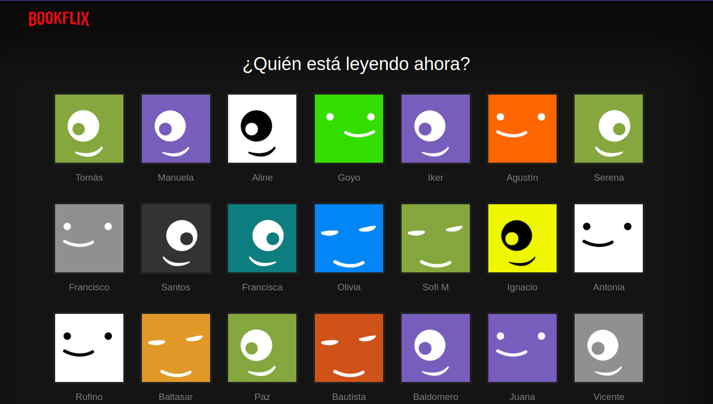
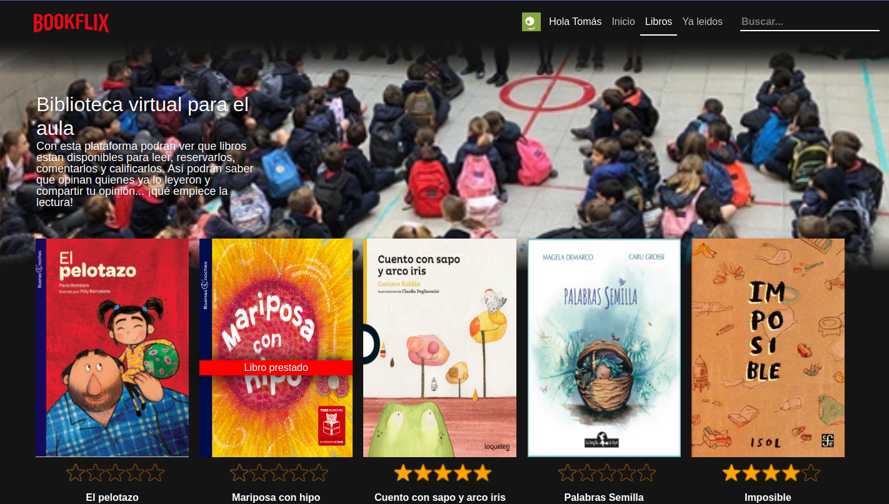
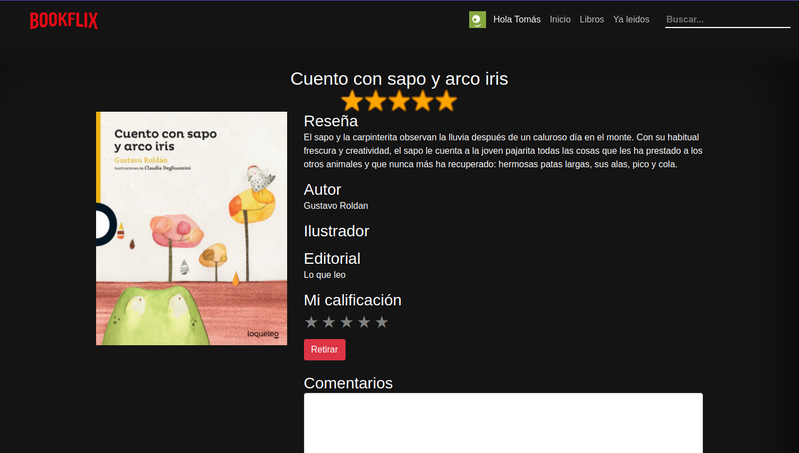

This Angular project was generated with [Angular CLI](https://github.com/angular/angular-cli) version 15.1.5. The Angular version is 15.2.10

## Summary of the project
Bookflix is a web app that was developed for a school in Argentina. The web application served as a platform to manage classroom book rentals, with the goal of making reading activities more engaging for children at school. Inspired by the design of Netflix, students could rent books from the classroom library and provide ratings and comments.



It was created in 2017 using Angular 2, and data persistence was handled directly by the real-time database of Firebase. Managing the backend with it was a relatively easy and straightforward process for me at those times, considering my limited experience in backend development on tbhose years.

<div style="display: flex; justify-align:center; ">


</div>


Currently, the project is undergoing migration to a more modern Angular version, with enhancements being made to both the UI design and the overall code structure.

## Migration state:

- [X] **Connection with Firebase Realtime Database**
- [X] **Initial page with a list of students**
- [X] **Home page with list of books**
- [X] **Book detail page**
- [X] **Rating functionality and calculation of the average of votes**
- [X] **Renting functionality and validation to avoid multiple rentals until the previous one is returned**
- [X] **Comments module on the book page**
- [X] **Search book functionality**
- [X] **Style adjustments on the students list page**
- [ ] **Style adjustments on the books list and book detail pages**
- [ ] **Admin page to mark the books returned by students**
- [ ] **Refactoring**
- [ ] **Typings reviews**


## Development server

Run `ng serve` for a dev server. Navigate to `http://localhost:4200/`. The application will automatically reload if you change any of the source files.


## Build

Run `ng build` to build the project. The build artifacts will be stored in the `dist/` directory.

## Upload to Firebase

```sh
$ ng build --prod
$ sudo firebase login
$ sudo firebase init
```

- What do you want to use as your public directory? dist
- Configure as a single-page app (rewrite all urls to /index.html)? Yes
- File dist/index.html already exists. Overwrite? No

```sh
$ sudo firebase deploy
```

## Dev link:
https://dev-bookflix.web.app/
